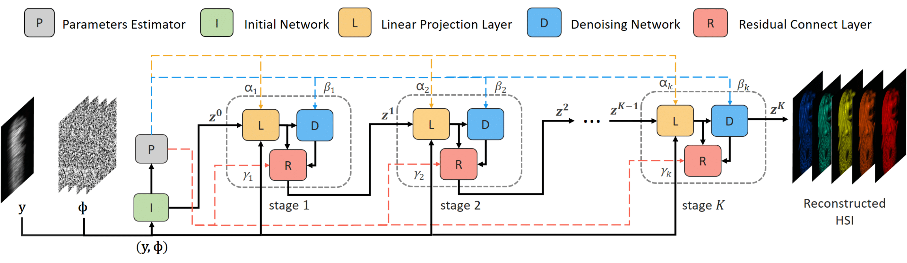

<div align="center">
<h1>SAUNet</h1>
<h3>A Simple Adaptive Unfolding Network for Hyperspectral Image Reconstruction</h3>

[Junyu Wang](https://github.com/Junyu99)<sup>1</sup> \*, [Shijie Wang](https://github.com/simonJJJ)<sup>1</sup> \*, [Wenyu Liu](http://eic.hust.edu.cn/professor/liuwenyu/)<sup>1</sup>, Zengqiang Zheng<sup>2</sup>, [Xinggang Wang](https://xinggangw.info/)<sup>1 :email:</sup>,
 
<sup>1</sup> [School of EIC, HUST](http://eic.hust.edu.cn/English/Home.htm), <sup>2</sup> [Wuhan Jingce Electronic Group](http://www.wuhanjingce.com/index.html).

(\*) equal contribution, (<sup>:email:</sup>) corresponding author.

Arxiv Preprint ([arxiv 2301.10208](https://arxiv.org/abs/2301.10208))

</div>

#

|                          *Scene 2*                           |                          *Scene 3*                           |                          *Scene 5*                           |                          *Scene 7*                           |
| :----------------------------------------------------------: | :----------------------------------------------------------: | :----------------------------------------------------------: | :----------------------------------------------------------: |
|  |  |  |  |

<p align="center">

</p>

### Quantitative Comparison on Simulation Dataset
> Results from the [paper](https://arxiv.org/abs/2301.10208)

Models and visualization results are available at [here](https://github.com/hustvl/Storage/releases/), [Google Drive](https://drive.google.com/drive/folders/1S001KwzzbyFy90tBoe5deSopUoS1RbJ5?usp=sharing) or [Baidu Drive](https://pan.baidu.com/s/133CUEhuJ1hDwSi60_X14EA?pwd=moma) (password: moma).
|                            Method                            | Params (M) | FLOPS (G) | PSNR  | SSIM  |                   Training GPU-hours                          |                   Inference Speed (FPS)                      |
| :----------------------------------------------------------: | :--------: | :-------: | :---: | :---: | :----------------------------------------------------------: | :----------------------------------------------------------: |
|       [SAUNet-1stg](https://github.com/hustvl/Storage/releases/download/v1.0/1stg_model_epoch_284.pth)        |    0.78    |   9.52   | 34.84 | 0.946 | 14.3 | 56.4 |
|       [SAUNet-2stg](https://github.com/hustvl/Storage/releases/download/v1.0/2stg_model_epoch_264.pth)        |    1.50    |   17.91   | 36.73 | 0.961 | 29.3 | 31.5 |
|       [SAUNet-3stg](https://github.com/hustvl/Storage/releases/download/v1.0/3stg_model_epoch_281.pth)        |    2.23    |   26.31   | 37.54 | 0.966 | 43.9 | 22.0 |
|       [SAUNet-5stg](https://github.com/hustvl/Storage/releases/download/v1.0/5stg_model_epoch_282.pth)        |    3.68    |   43.10   | 38.16 | 0.970 | 71.5 | 13.1 |
|       [SAUNet-9stg](https://github.com/hustvl/Storage/releases/download/v1.0/9stg_model_epoch_271.pth)        |    6.59    |   76.68   | 38.57 | 0.973 | 149.0 | 7.8 |
|       [SAUNet-13stg](https://github.com/hustvl/Storage/releases/download/v1.0/13stg_model_epoch_247.pth)       |    9.50    |   110.25  | 38.79 | 0.974 | 215.0 | 5.5 |

<details>
  <summary>Table Notes (click to expand)</summary>
  
  - Training GPU-hours and Inference Speed are obtained by a Tesla v100 GPU.  
  - Training GPU-hours only includes the time of forward and backward propagation.  
  - Inference Speed averages the input measurement of 256 x 310 at 800 times with batchsize = 1.
</details>  

### Create Environment:

- Python 3 (Recommend to use [Anaconda](https://www.anaconda.com/download/#linux))

- [PyTorch >= 1.7](https://pytorch.org/)

- NVIDIA GPU + [CUDA](https://developer.nvidia.com/cuda-downloads)

- Python packages:

  ```shell
  pip install -r requirements.txt
  ```

### Prepare Dataset:

Download the dataset from https://github.com/mengziyi64/TSA-Net, put the dataset into the corresponding folder 'code/datasets/', and recollect them in the following form:

    |--datasets
        |--cave_1024_28
            |--scene1.mat
            |--scene2.mat
            ：  
            |--scene205.mat
        |--CAVE_512_28
            |--scene1.mat
            |--scene2.mat
            ：  
            |--scene30.mat
        |--KAIST_CVPR2021  
            |--1.mat
            |--2.mat
            ： 
            |--30.mat
        |--TSA_simu_data  
            |--mask.mat   
            |--Truth
                |--scene01.mat
                |--scene02.mat
                ： 
                |--scene10.mat
        |--TSA_real_data  
            |--mask.mat   
            |--Measurements
                |--scene1.mat
                |--scene2.mat
                ： 
                |--scene5.mat
### Training and Testing for simulation experiment
#### Training 
Please use checkpointing (--cp) when running out of memory.
```python
#SAUNet-1stg
python simu_train.py --method saunet_1stg --outf ./exp/simu_saunet_1stg/ --seed 24 --gpu_id 0
#SAUNet-2stg
python simu_train.py --method saunet_2stg --outf ./exp/simu_saunet_2stg/ --seed 24 --gpu_id 0
#SAUNet-3stg
python simu_train.py --method saunet_3stg --outf ./exp/simu_saunet_3stg/ --seed 24 --gpu_id 0
#SAUNet-5stg
python simu_train.py --method saunet_5stg --outf ./exp/simu_saunet_5stg/ --seed 24 --gpu_id 0
#SAUNet-9stg 
python simu_train.py --method saunet_9stg --outf ./exp/simu_saunet_9stg/ --seed 24 --gpu_id 0 
#SAUNet-13stg 
python simu_train.py --method saunet_13stg --outf ./exp/simu_saunet_13stg/ --seed 24 --gpu_id 0 
```
#### Testing 
a). Test our models on the HSI dataset. The results will be saved in 'code/evaluation/testing_result/' in the MatFile format. For example, we test the SAUNet-3stg:
```python
python simu_test.py --method saunet_3stg --outf ./test/simu_saunet_3stg  --pretrained_model_path [your saunet_3stg model path]
```
b). Calculate quality assessment. We use the same quality assessment code as DGSMP. So please use Matlab, get in 'code/analysis_tools/Quality_Metrics/', and then run 'Cal_quality_assessment.m'.

### Training and Testing for real data experiment:
#### Training
Please use checkpointing (--cp) when running out of memory.
```python
#SAUNet-1stg
python real_train.py --method saunet_1stg --outf ./exp/real_saunet_1stg/ --seed 24 --gpu_id 0 --isTrain
#SAUNet-2stg
python real_train.py --method saunet_2stg --outf ./exp/real_saunet_2stg/ --seed 24 --gpu_id 0 --isTrain
#SAUNet-3stg
python real_train.py --method saunet_3stg --outf ./exp/real_saunet_3stg/ --seed 24 --gpu_id 0 --isTrain
#SAUNet-5stg
python real_train.py --method saunet_5stg --outf ./exp/real_saunet_5stg/ --seed 24 --gpu_id 0 --isTrain
#SAUNet-9stg 
python real_train.py --method saunet_9stg --outf ./exp/real_saunet_9stg/ --seed 24 --gpu_id 0 --isTrain
#SAUNet-13stg 
python real_train.py --method saunet_13stg --outf ./exp/real_saunet_13stg/ --seed 24 --gpu_id 0 --isTrain
```
#### Testing 
a). Test our models on the HSI dataset. The results will be saved in 'code/evaluation/testing_result/' in the MatFile format. For example, we test the SAUNet-3stg:
```
python real_test.py --method saunet_3stg --outf ./test/real_saunet_3stg/ --pretrained_model_path [your saunet_3stg model path]
```

b). Calculate quality assessment. We use no reference image quality assessments (Naturalness Image Quality Evaluator, **NIQE** ). So please use Matlab, get in 'code/analysis_tools/Quality_Metrics/', and then run 'NIQE_metric.m'.

### Inference FPS
If we want to get inference fps of SAUNet-3stg, run the following commond:
```python
python test_fps.py --method saunet_3stg --outf ./test/real_saunet_3stg --gpu_id 0
```

### Training time
Afer you finish the training of model, please run these commands:
```
cd analysis_tools/
python tranining_time.py [your training log path]
```

### Evaluating the Params and FLOPS of models
You can get the Params and FLOPS of models **at the begin of training**. Or use following commonds 
(for instance, we get these values of SAUNet-3stg. Other methods are similar):
```python
python test_fps.py --method saunet_3stg --outf [your log path to save]
```

### Acknowledgement
This project is based on [MST](https://github.com/caiyuanhao1998/MST). Thanks for the wonderful works.

### License

SAUNet is released under the [MIT License](LICENSE).

### Citation

If you find our paper and code useful in your research, please consider giving a star :star: and citation :pencil: :)

```BibTeX
@article{SAUNet,
  title={A Simple Adaptive Unfolding Network for Hyperspectral Image Reconstruction},
  author={Wang, Junyu and Wang, Shijie and Liu, Wenyu and Zheng, Zengqiang and Wang, Xinggang},
  journal={arXiv preprint arXiv:2301.10208},
  year={2023}
}
```
